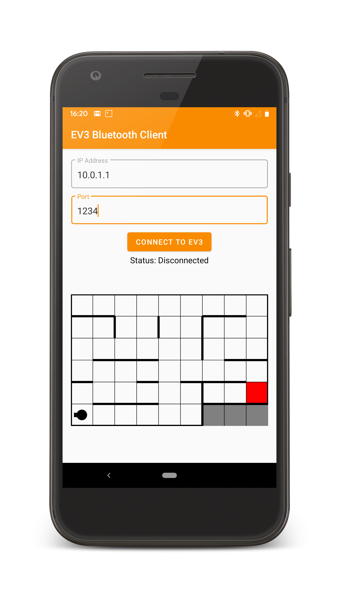

# Bluetooth Android Client for connecting to EV3 robots 

## Usage

**Make sure your device is not on WiFi or Mobile Data for best results.**

Before you use the app, you will need a ServerSocket running on the EV3 waiting for the client to connect. 

1. On the EV3, search for your device in Search/Pair.
2. Once found, select your device and select again with the default code (probably 0000). It will prompt a code on your device. Just press "Confirm".
3. Once successfully connected, go to the EV3 on your Android phone and tick "Internet access".
4. If you have a terminal on your phone, you can type "ping `IP displayed on EV3 home screen`" to see if you have connected properly.
5. Use the app.

Find it on [Google Play](https://play.google.com/store/apps/details?id=com.will_russell.ev3bluetoothclient)
